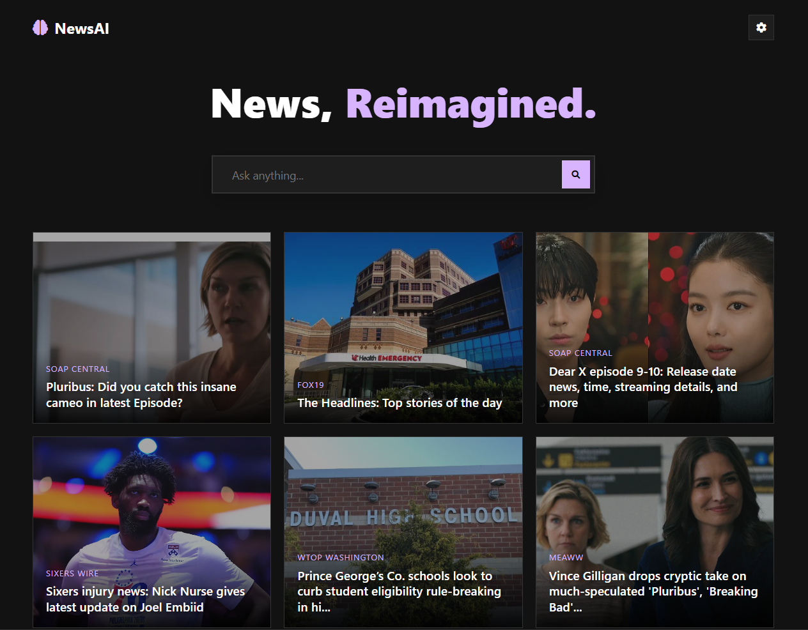

# News AI App

**A smart, AI-powered news aggregator that gives you the full picture with real-time perspectives and bias analysis.**

## Description / Overview
In an era of information overload and polarized media, getting the objective truth is harder than ever. **News AI App** solves this by aggregating the latest headlines and using advanced AI (Gemini) to analyze each story instantly.

It doesn't just show you the news; it breaks down the bias, summarizes the key points, and most importantly, finds and presents distinct points of view from real, diverse sources. This application is designed for news junkies and critical thinkers who want to escape the echo chamber.

## Demo


## Installation

1.  **Clone the repository:**
    ```bash
    git clone https://github.com/aryarakshit/NewsAI.git
    cd NewsAI
    ```

2.  **Create a virtual environment:**
    ```bash
    python -m venv venv
    # Windows
    venv\Scripts\activate
    # Mac/Linux
    source venv/bin/activate
    ```

3.  **Install dependencies:**
    ```bash
    pip install -r requirements.txt
    ```

4.  **Set up Environment Variables:**
    Create a `.env` file in the root directory and add your Google Gemini API key:
    ```env
    GEMINI_API_KEY=your_api_key_here
    ```

## Usage

1.  **Run the application:**
    ```bash
    python app.py
    ```

2.  **Open your browser:**
    Navigate to `http://127.0.0.1:5000` to start browsing the news.

## Features

*   **AI-Powered Analysis**: Instantly summarizes articles, detects bias, and assigns a trust score.
*   **Real Source Perspectives**: Automatically finds and links to "Conservative", "Progressive", and "Mainstream" articles covering the same topic.
*   **Smart Search**: Fetches the freshest news using DuckDuckGo, with robust fallback strategies to ensure you never see an empty feed.
*   **Save & Curate**: Bookmark important stories to your personal profile for later reading.
*   **Responsive Design**: A modern, "Tekina-style" UI that looks great on desktop and mobile.

## Tech Stack / Built With

*   **Python (Flask)**: Backend framework.
*   **Google Gemini API**: AI analysis and content generation.
*   **DuckDuckGo Search (ddgs)**: Real-time news fetching.
*   **HTML/CSS/JS**: Vanilla frontend for maximum performance.

## Contributing

Contributions are welcome! Please fork the repository and submit a pull request.
1.  Fork the Project
2.  Create your Feature Branch (`git checkout -b feature/AmazingFeature`)
3.  Commit your Changes (`git commit -m 'Add some AmazingFeature'`)
4.  Push to the Branch (`git push origin feature/AmazingFeature`)
5.  Open a Pull Request

## License

Distributed under the MIT License. See `LICENSE` for more information.

## Credits / Acknowledgments

*   **Google Gemini Team** for the powerful AI API.
*   **DuckDuckGo** for the search capabilities.
*   **Open Source Community** for the inspiration.
